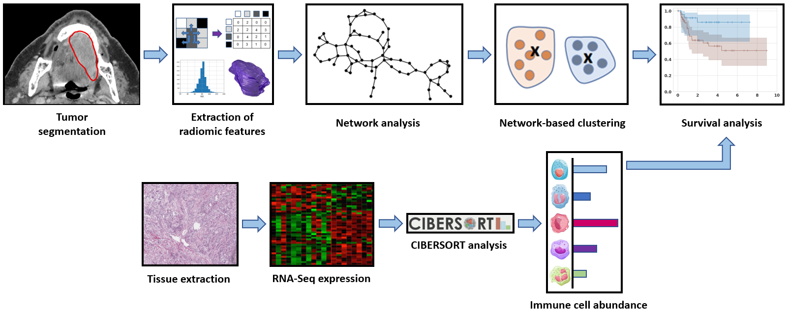
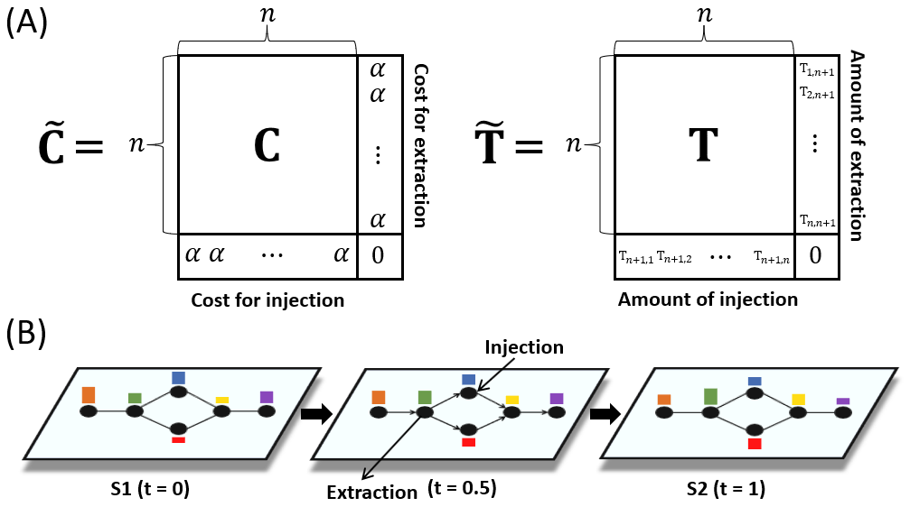

# Radiomic clustering using graph network techniques coupled with unbalanced optimal transport 

Radiogenomic data analysis pipeline. Sample clustering was conducted using our proposed network-based k-means method coupled with unbalanced optimal transport on radiomic features to identify sub-groups. Tumor immune cell abundance was then compared between the identified sub-groups.
#

Introduction of unbalanced optimal transport. (A) The cost and transport plan matrices for unbalanced optimal transport and (B) A displacement interpolation on a network between two samples (S1 and S2). Unbalanced optimal transport allows for injection and extraction of mass to and from the network.
#

1. Code  
   - UOTK.ipynb  

2. Data  
   - radiomic_data_HN.csv: Radiomic data extracted from CT scans of TCIA head and neck cancer
   - correlation_data.csv: Correlation data between radiomic features
